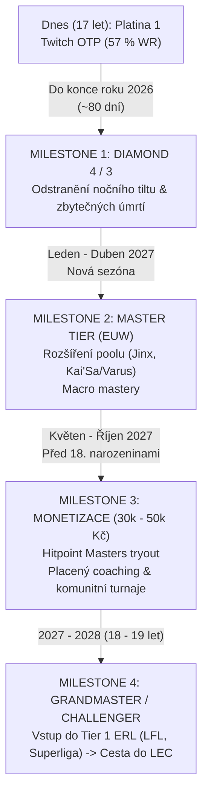

# 🚀 ROADMAP: Cesta z Platiny do Challengeru & LEC

> **Hráč:** In the Dark#CHALL (EUW)  
> **Startovní pozice (17 let):** Platina 1 (9 LP) / Platina 3  
> **Časový horizont:** 12 měsíců do 18. narozenin (Finanční cíl) | 24 měsíců do 19 let (Challenger & ERL)  
> **Závazek vůči rodičům:** Vydělat 30 000 – 50 000 Kč hraním LoL před 18. narozeninami

---

## 🧭 1. Hlavní milníky a časová osa



---

## 🔍 2. Diagnóza profilu: Kde krvácí tvoje LP?

Analýza účtu `In the Dark#CHALL` ukázala obrovský potenciál, ale také sebedestruktivní návyky:

| Metrika | Realita | Důsledek | Náprava od dneška |
| :--- | :--- | :--- | :--- |
| **Twitch** | **57,3 % WR (199W – 148L)** | Mechaniky jsou na úrovni Diamondu. | **Twitch je tvůj primární nástroj.** Hraj ho v 95 % případů. |
| **Ostatní šampioni** | Draven (26 %), Jinx (31 %), Kog (37 %) | **Ztráta cca 800 LP.** Sám sebe táhneš dolů. | **Zákaz zkoušení jiných šampionů v SoloQ.** Max 1 záloha, jinak DODGE. |
| **Průměrné smrti** | **8–11 úmrtí na hru** (i při výhrách) | Neustálé odevzdávání shutdownů a prohrávání teamfightů. | Zavést **Pravidlo 3 vteřin** v teamfightech. Cíl: max 4 smrti. |
| **Čas hraní** | Hry v **04:24 – 05:21 ráno** | Tilt-queueing, spánková deprivace, ztráta reflexů. | **Hard stop v 23:30.** Žádný ranked v noci. |
| **CS v prohrách** | **4–5 CS/min (114–150 CS)** | V prohraných hrách přestáváš farmit a jen se pereš. | Udržet 7,5+ CS/min z bočních linek i při ztrátě. |

---

## 🧠 3. Kompletní Twitch Macro Masterclass (Tutoriál)

### A. Laning Phase & Wave Management
1. **Crash na 3. vlně (Kánon):**
   * Twitch má slabý level 1–3. Pokud pushuješ, vlnu musíš do nepřátelské věže dostat **vždy na kanónové vlně (čas ~2:45–3:15)**.
   * Kanónová vlna zdrží soupeře pod věží nejdéle → máš bezplatné okno na recall a nákup itemu bez ztráty minionů.
2. **Freeze před vlastní věží:**
   * Pokud je linka těžká (např. Caitlyn/Lux, Draven/Nautilus), nech soupeře pushovat.
   * Udržuj 3 nepřátelské caster miniony živé kousek před dosahem tvé věže. Tady jsi v bezpečí před ganky a tvůj support může iniciovat fight.
3. **Pláty a nová mechanika sezóny (Perma plates & Crystalline Overgrowth):**
   * Pláty už nemizí ve 14. minutě a jsou i na Tier 2 a Tier 3 věžích.
   * **MÝTUS:** *„Nechat bot věž stát a šikanovat soupeře.“* -> **OBROVSKÁ CHYBA.**
   * Soupeř s 0/4 má hodnotu jen ~120 goldů (pár minionů), zatímco ty riskuješ svůj 700–1000g shutdown.
   * **Správný tah:** Rychle zničit Bot Tier 1 věž → vzít First Brick → rotovat na Mid Tier 1 → brát další pláty a ovládnout nepřátelskou jungle.

### B. Rotace po laning phase (Čas 12:00+)
* **Bot linka pro tebe končí:** Jakmile padne první věž, **okamžitě jdi na MID**.
* Midlaner s Teleportem musí jít na bot/top.
* **Proč Twitch na midu?**
  * Mid je nejkratší linka = nejbezpečnější pro šampiona bez dashe.
  * Ze středu mapy můžeš být za 15 vteřin ve stealthu u Barona i u Draka.
  * Můžeš odchytávat enemy supporta nebo midlanera rotujícího řekou.

### C. Teamfight & Stealth Execution (Pravidlo 3 vteřin)
* **Před začátkem teamfightu (V loadingu):** Identifikuj 2–3 schopnosti, které tě zabijí (např. *Malphite R, Vi R, Leona R, Zed W/R*).
* **Zahájení fightu:** Zapni **Q** (neviditelnost), ale **NESTŘÍLEJ**.
* Nech svůj tým a nepřátele zahájit kontakt. Počkej 2–3 vteřiny, než soupeři vyplýtvají své klíčové crowd control ability na tvůj frontline.
* **Trigger:** Teprve když je nepřítel zaháčkovaný a nemá čím skočit na tebe, zapni **R + Ghost** a začni Spaceglide z maximálního dosahu.

### D. Objective Setup (Pravidlo 40 sekund)
* **40s do Draka/Barona:** Vyčisti a pushni midovou vlnu.
* **25s do Draka/Barona:** Aktivuj **Q** a jdi s junglerem/supportem do řeky vyčistit vizi a nastražit past. V neviditelnosti jsi nebezpečný lovec na nepřátelského supporta, který jde wardovat.

---

## 💰 4. Finanční plán: Jak legálně vydělat 30k – 50k Kč do 18 let

Tento plán splní dohodu s rodiči a ukáže jim reálné výsledky:

```
┌─────────────────────────────────────────────────────────────┐
│ ROZPOČET DO 18. NAROZENIN                                   │
├─────────────────────────────────────────────────────────────┤
│ 1. Česká liga (Hitpoint Masters / Challengers stipendia)    │
│    └── 15 000 – 25 000 Kč                                   │
│ 2. Placený Coaching (Trénování low-elo hráčů)               │
│    └── 12 000 – 20 000 Kč                                   │
│ 3. Komunitní turnaje (Playzone, Red Bull, MČR kvalifikace)  │
│    └── 5 000 – 10 000 Kč                                    │
│ 4. Twitch Stream & TikTok highlights                        │
│    └── 3 000 – 5 000 Kč                                     │
├─────────────────────────────────────────────────────────────┤
│ CELKEM: 35 000 – 60 000 Kč                                  │
└─────────────────────────────────────────────────────────────┘
```

### Krok 1: Vstup do CZ/SK týmů (Jaro/Léto 2027)
* Jakmile hitneš **Master 100+ LP**, máš otevřené dveře do české komunity.
* Sleduj tryouty týmů: **Dynamo Eclot (Academy), Entropiq, eSuba, Brute, Cryptova**.
* Měsíční plat v české lize: cca 3 000 – 8 000 Kč měsíčně. Za jeden split (3 měsíce) jsi na 15 000 – 25 000 Kč.

### Krok 2: Placený Coaching (Nejspolehlivější cashflow)
* Jako Master Twitch můžeš nabízet coaching pro Silver / Gold / Platina střelce.
* **Cena:** 250 – 350 Kč za hodinovou lekci (rozbor záznamu + live game).
* **Matematika:** 3 hodiny týdně = cca 3 600 Kč měsíčně = **cca 15 000 Kč za 4 měsíce**.
* Kde hledat klienty: Česko-slovenské LoL Discordy, Facebook skupiny, TikTok klipy s tipy.

> ⚠️ **SMRTELNÉ VAROVÁNÍ: NIKDY NEDĚLEJ ELO-BOOSTING ANI PRODEJ ÚČTŮ!**  
> Riot Games prověřuje účty všech hráčů vstupujících do oficiálních lig (Hitpoint, ERL, LEC). Pokud zjistí boosting, dostaneš **zákaz závodního hraní na 1–2 roky nebo trvale**. Tím by tvůj sen o LEC skončil.

---

## 📚 5. Doporučené studijní kanály & Zdroje

Pokud chceš být profík, musíš se učit od nejlepších:

* **Twitch specialisté:**
  * **RATIRL** – archivy her (mechaniky, spacegliding, assassination angles).
  * **Wackaflacka** – Master/Challenger Twitch guides a buildy.
* **ADC Fundamentals & Macro:**
  * **Shok (YouTube)** – Nejlepší analytická videa pro linkovou fázi a positioning.
  * **xSFn Sabin (YouTube)** – Detailní rozbory ADC mechanik a tetheringu (vzdálenosti od nepřítele).
  * **AloisNL (YouTube)** – Ačkoliv toplaner, jeho tutoriály o vlnách (Level 2 timer, crash, tempo) jsou nejlepší na internetu.
* **Mentální a esportová příprava:**
  * **Broken By Concept podcast (Coach Curtis & Nathan Mott)** – Jak překonat tilt, jak pracovat se sebekontrolou a jak přistupovat k tréninku.

---

## ⏰ 6. Denní režim profesionálního atleta

Challenger hráč nevzniká náhodným ponocováním, ale disciplínou:

| Čas | Aktivita | Detail |
| :--- | :--- | :--- |
| **07:00 – 15:00** | Škola & Povinnosti | Měj čistý štít. Dobré známky = klid od rodičů a nulový stres u hraní. |
| **16:00 – 16:30** | Pohyb & Reset | Rychlá procházka, kliky/protažení, vyvětrat pokoj, dostatek vody. |
| **16:30 – 16:45** | **Warm-up** | Practice Tool: 10 min CSing bez itemů, 1 hra Arena/ARAM na zahřátí rukou. |
| **16:45 – 19:15** | **Ranked Blok 1** | **3 hry s maximálním fokusem.** Pouze Twitch. Sledovat minimapu, max 4 smrti. |
| **19:15 – 19:30** | **VOD Review** | Rychlý rozbor: Přetoč si každou svou smrt v replayi. Zapiš si, proč jsi umřel. |
| **19:30 – 20:30** | Večeře & Pauza | Odpočinek od monitoru. |
| **20:30 – 22:30** | **Ranked Blok 2 / VODs** | Max 2 hry (pokud nejsi unavený) NEBO studium zápasů pro hráčů. |
| **23:00** | **Spánek** | Regenerace mozku. 8 hodin spánku = rychlé reakce zítra. |

---

## ✍️ Tvoje dohoda se sebou samým

Dnes končí fáze „závislého kluka, co si chce hrát“.  
Zítra v 17 letech začíná fáze budoucího esportového hráče, který ví, co dělá, má plán a dokáže rodičům i sobě, že na to má.

1. **Žádné výmluvy na tým.**
2. **Žádné hry ve 4 ráno.**
3. **Plné soustředění na cíl: Diamond do konce roku.**
