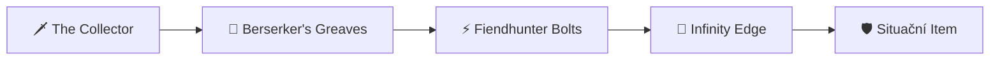
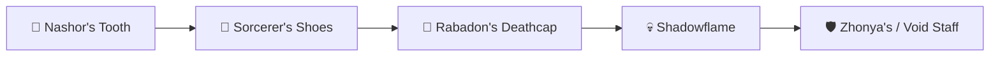
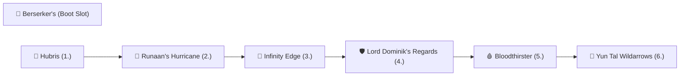

# 🛸 LEAGUE OF LEGENDS // PROTOCOL: ANTIGRAVITY


> *High-Performance Ranked Execution, Ergonomic Health Blueprint & Complete Twitch Matchup Guide.*

---

## 📅 System Overview & Weekly Schedule

| Day | Session Volume | VOD Analysis | Focus & Directives |
| :--- | :---: | :---: | :--- |
| **Pondělí** | `3–5 games` | 10 min | 🏫 Školní den • Disciplína |
| **Úterý** | `3–5 games` | 10 min | 🏫 Školní den • Disciplína |
| **Středa** | `3–5 games` | 10 min | 🏫 Školní den • Disciplína |
| **Čtvrtek** | `3–5 games` | 10 min | 🏫 Školní den • Disciplína |
| **Pátek** | `4–8 games` | 20 min | 🚀 **Návrat na EUW! Delší session.** |
| **Sobota** | `8–14 games` | 30 min | 🔥 **MAXIMUM GRIND. Ranní start!** |
| **Neděle** | `8–14 games` | 30 min | 🔥 **MAXIMUM GRIND. Ranní start!** |

> [!NOTE]
> **Týdenní target:** `32–56 her/týden` | **VOD Time:** `~2 hodiny`  
> **Měsíční celkový objem:** `~130–220 her za měsíc`

---

## 🚨 Emergency Controls (LP Safeguard Protocol)

> [!CAUTION]
> ### 🔴 RULE: STOP (Immediate Execution Termination)
> Abort session **instantly** if any of these conditions are met:
> 1. **2 prohry v řadě** → Pauza minimálně 1 hodinu.
> 2. **Cítíš vztek / Tilt** → Vypni hru, jdi na vzduch.
> 3. **Čas > 23:00** → Nulové výjimky. NIKDY nezačínej další.
> 4. **Fyzický discomfort (zápěstí/oči)** → Okamžitý stop, protažení, odpočinek.

> [!TIP]
> ### 🟢 RULE: CONTINUE (Green Light Checklist)
> Continue gaming session **only** when all conditions pass:
> - [x] **Flow State:** Vyhráváš a máš čistou hlavu.
> - [x] **Duty Free:** Žádné nevyřešené školní povinnosti na zítřek.
> - [x] **Physiology:** Cítíš se fyzicky odpočatý a bez bolesti.
> - [x] **Time Check:** Hodiny ukazují čas před 22:00.

---

## 🖐️ Anti-RSI Health Protocol (Wrist & Hand Care)

> [!IMPORTANT]
> **RSI Hazard Level: HIGH** (ADC Main + Quaver Player)  
> *Prováděj tento 2-minutový set během každé pauzy mezi bloky!*

```
[STRETCH ROUTINE] ──► 1. Prayer ──► 2. Circles ──► 3. Spread ──► 4. Shake Out
```

1. **🙏 Prayer Stretch (`30s`):** Spoj dlaně před hrudníkem (jako modlitba). Tlač dlaně dolů, dokud necítíš tah v zápěstích. *Drž 15s → Uvolni → Opakuj.*
2. **🔄 Wrist Circles (`30s`):** Zavři pěsti a kresli zápěstími pomalé, plynulé kruhy. *10× doprava, 10× doleva.*
3. **🖐️ Finger Spread (`30s`):** Rozevři všech 10 prstů co nejšíř na maximum. *Drž 5s → Zavři v pěst → Opakuj 5×.*
4. **👋 Shake Out (`30s`):** Uvolni paže a setřes ruce, jako bys z nich shazoval kapky vody. *30 sekund volného uvolňovacího třepání.*

---

## 🏆 Champion Pool pro Vyšší Ranky (High-Elo Expansion)

Pro stabilní climbing ve vyšších rancích (Emerald → Diamond → Master) je ideální udržovat **pool 2–3 championů**, kteří pokrývají různé týmové kompozice a draftové situace:

| Champion | Typ / Role | Kdy zvolit (Draft Condition) | Náročnost |
| :--- | :--- | :--- | :---: |
| 🐀 **Twitch** | **OTP / Primary Main** | Blind pick, potřeba carry z stealthu, hypercarry teamfight. | ⭐⭐⭐⭐☆ |
| 🚀 **Kai'Sa** | **Flex Carry (AD/AP)** | Tým má heavy engage, potřebuješ self-peel (R shield/dash) nebo hybrid DMG. | ⭐⭐⭐☆☆ |
| 💣 **Jinx** | **Hypercarry Standard** | Front-to-back teamfighty, silná CC kompozice, klasický DPS carry. | ⭐⭐☆☆☆ |
| 🪶 **Xayah** | **Anti-Dive Pick** | Soupeř má heavy engage / assassiny (Rengar, Nocturne, Nautilus, Zed). | ⭐⭐⭐⭐☆ |
| 🏹 **Varus** | **Utility & Poke / On-Hit** | Tým postrádá CC/Initiation nebo potřeba dominance na lince. | ⭐⭐⭐☆☆ |

---

## 🐀 Twitch Setup & Build Architectures (Patch 26.20 – Worlds 2026)

> [!NOTE]
> **Aktuální patch:** 26.20 (Worlds 2026 patch, vydán 7. října 2026).  
> Runaan's Hurricane a Experimental Hexplate dostaly nerf. Meta se přesunula k vysokému burst critu.  
> Výběr správného buildu závisí na kompozici soupeře. **AD** je nejlepší v dlouhých fightech a proti tankům, **AP** je destruktivní proti squishy týmům pro okamžitý burst z Q stealthu.

### 1. ⚔️ AD Twitch – „Spaceglide Crit Burst" (Hlavní build – Highest WR)
*Nejlepší proti: Většině kompozic. Dominantní v teamfightech s R.*



* **Core Build (1–3 itemy):**
  * 🗡️ `The Collector` – První item. Lethality + execute pod 5 % HP = snowball z raného leadu.
  * 👟 `Berserker's Greaves` – Základní boty pro attack speed.
  * ⚡ `Fiendhunter Bolts` – **KLÍČOVÝ ITEM pro Twitche v patchi 26.20.** Poskytuje Attack Speed, Crit a **30 Ultimate Ability Haste** (výrazně zkrátí cooldown na Spray and Pray). Pasivní efekt *Opening Barrage* dává bonus AS a posílí první 3 útoky po použití ulti → perfektní synergie s R.
  * 💎 `Infinity Edge` – Třetí hotový item. Obrovský damage spike díky zesílenému crit dmg.

* **Situační 4. a 5. item (vyber podle draftu):**
  * 🛡️ `Lord Dominik's Regards` – Soupeř má 2+ tanky s high armorem (Malphite, Ornn, Sejuani).
  * 🩸 `Mortal Reminder` – Soupeř má heavy healing (Soraka, Aatrox, Red Kayn, Vladimir).
  * 🛡️ `Guardian Angel` – Potřebuješ druhou šanci v klíčovém teamfightu (Baron/Elder).
  * ⚔️ `Bloodthirster` – Potřebuješ lifesteal a shield pro přežití v dlouhých fightech.
  * 🔓 `Mercurial Scimitar` – Soupeř má point-and-click CC (Malzahar R, Skarner R, Mordekaiser R).

* **Runy (AD – Spaceglide & Infinite Scaling):**
  * 🟡 **Precision (Primary):**
    * **Keystone:** `Lethal Tempo` (standard pro sustained DPS, překročení AS capu a spaceglide)
    * `Triumph` (heal po killu = přežití v divokých teamfightech)
    * `Legend: Alacrity` (bonus Attack Speed pro plynulejší kiting)
    * `Cut Down` (bonus poškození proti tankům a high-HP cílům)
  * 🔵 **Sorcery (Secondary – God Tier Scaling & Speed):**
    * `Celerity` (zesiluje MS z Q stealthu, Ghostu a Runaanu – naprosto klíčové pro spacing a kite!)
    * `Gathering Storm` (nekonečné škálování bonusového AD; v 30.+ minutě dostáváš celý item zdarma)

* **Summoner Spells:** `Flash` + `Ghost` (dokonalá synergie s Celerity pro maximální spaceglide) NEBO `Flash` + `Cleanse`

---

### 2. 🧪 AP Twitch – „Rat Assassin Burst" (Situační / Off-Meta)
*Nejlepší proti: Full squishy týmům bez tanků, kde potřebuješ okamžitý burst z Q stealthu.*



* **Core Build:**
  * 🦷 `Nashor's Tooth` – První item. AS + on-hit magic dmg synergizuje s passive jedem.
  * 👟 `Sorcerer's Shoes` – Magic Pen boty pro maximální burst.
  * 🎩 `Rabadon's Deathcap` – Obrovský AP spike, masivně zvyšuje E (Contaminate) damage.
  * 💀 `Shadowflame` – Burst multiplier pro squishy cíle.

* **Situační itemy:**
  * 🟣 `Void Staff` – Soupeř stackuje Magic Resist.
  * ⏳ `Zhonya's Hourglass` – Přežití po otevření ze stealthu (použij po R combo).
  * 📚 `Mejai's Soulstealer` – Riskantní, ale extrémně silný při snowballu.

* **Runy (AP – Patch 26.20):**
  * 🟡 **Precision (Primary):**
    * **Keystone:** `Press the Attack` (burst z 3 auto-attacků po otevření z Q) NEBO `Lethal Tempo`
    * `Presence of Mind` (mana sustain pro spam E)
    * `Legend: Alacrity` (AS)
    * `Cut Down` (bonus dmg)
  * 🔵 **Sorcery (Secondary):**
    * `Absolute Focus` (bonus AP při high HP = silnější opener ze stealthu)
    * `Gathering Storm` (scaling AP pro late game)

* **Summoner Spells:** `Flash` + `Ignite` (all-in burst) NEBO `Flash` + `Ghost`

> [!WARNING]
> **Kdy NEHRÁT AP Twitche:**  
> Pokud soupeř má 2+ tanky (Malphite, Ornn, Sejuani, Cho'Gath), AP Twitch je prakticky k ničemu. V takovém draftu jdi VŽDY AD s Lord Dominik's Regards.

---

### 3. 👑 Hubris AoE Crit Shredder (7-Item Slot System)
*Nejznámější 1v9 SoloQ build (styl RATIRL). Využívá **ADC Role Quest (7. dedikovaný slot na boty)** pro dosažení 100% Critu a maximálního plošného poškození.*



* **Core Build Order (7 slotů):**
  * 👟 `Berserker's Greaves` (Dedicated Boot Slot z ADC Role Questu) – Rychlost a attack speed bez zabírání místa pro zbraně!
  * 👑 `Hubris` (1. item) – Masivní raw AD (60 AD), 18 Lethality a 15 AH. Za každý kill dostaneš sochu (Ego stack) a **15 (+2 za každý stack) bonusového AD na 90 sekund**.
  * 🏹 `Runaan's Hurricane` (2. item) – **Klíčový most buildu.** Dokonale vykompenzuje absenci attack speedu z Hubrisu a aplikuje bonusové AD na další 2 cíle v teamfightu.
  * 💎 `Infinity Edge` (3. item) – Zesílení crit poškození. V kombinaci s Hubris AD buffem a Runaanem smažeš celý nepřátelský tým za 2 vteřiny.
  * 🛡️ `Lord Dominik's Regards` (4. item) – Armor penetration; v této fázi hry už roztavíš i heavy tanky (Ornn, Malphite, K'Sante).
  * 🩸 `Bloodthirster` (5. item) – Lifesteal + štít pro přežití v divokých teamfightech.
  * 🏹 `Yun Tal Wildarrows` / 🛡️ `Guardian Angel` / ⚡ `Fiendhunter Bolts` (6. legendární item – **Finisher podle situace**):
    * **Nový Yun Tal (Rework – *Practice Makes Lethal* & *Flurry*):** Už nemá starý bleed! Místo toho trvale stackuje Crit šanci až do +25 % a dává Flurry Attack Speed burst. Skvělý na 100% crit cap a maximální AS.
    * 🛡️ **`Guardian Angel`:** Nejlepší volba pro late-game bezpečí (druhá šance u Barona / Eldera).
    * ⚡ **`Fiendhunter Bolts`:** Pokud chceš zkrátit cooldown ultimátky a mít posílené první 3 střely po stisknutí R.

* **Runy (Hubris + Runaan setup – Celerity Speed & Scaling):**
  * 🟡 **Precision (Primary):**
    * `Lethal Tempo` (v synergii s Runaanem překračuješ attack speed cap a kiting je čistý glide)
    * `Triumph` (heal po killu v teamfightu)
    * `Legend: Alacrity` (další attack speed)
    * `Cut Down` (bonus poškození proti tankům a bruiserům)
  * 🔵 **Sorcery (Secondary):**
    * `Celerity` (synergie s Runaan MS, Ghostem a Q – nepřátelé tě nedoběhnou)
    * `Gathering Storm` (stackuje další permanentní AD k už tak obřímu Hubris poškození)

---

#### ⚖️ Kdy hrát Hubris ➔ Runaan vs. Collector ➔ Fiendhunter?

| Situace v draftu | Doporučený build | Proč |
| :--- | :--- | :--- |
| **Teamfighty 5v5, shlukující se soupeři, hra na snowball** | 👑 **Hubris ➔ Runaan ➔ IE ➔ LDR** | Plošný AoE damage z Runaanu přenáší obří Hubris AD na 3 lidi naráz. |
| **Pick-offy ze stealthu, potřeba ulti každých 40s** | 🗡️ **Collector ➔ Fiendhunter ➔ IE** | Fiendhunter dává 30 Ultimate Haste a Opening Barrage burst na 1 cíl. |

---

## ⚔️ Twitch Bot Lane Matchup Matrix (ADC & APC)

```
 🟢 SNADNÉ (Favored)          🟡 SKILL MATCHUP (Even)         🔴 TĚŽKÉ (Counter)
 ───────────────────          ───────────────────────         ───────────────────
 • Jhin                       • Vayne                         • Caitlyn
 • Ezreal                     • Kai'Sa                        • Draven
 • Kog'Maw                    • Jinx                          • Samira
 • Aphelios                   • Lucian                        • Tristana
 • Ashe / Sivir               • Zeri / Varus                  • Nilah / Kalista
 ────────────────────────────────────────────────────────────────────────────────
 🔮 APC: Karthus              🔮 APC: Seraphine / Brand       🔮 APC: Ziggs / Veigar / Swain
```

<details>
<summary>🔍 <b>Klikni pro detailní rozbor ADC matchupů</b></summary>

### 🟢 Snadné matchupy
* **Jhin:** Nemá escape. Jakmile máš lvl 6 a Q stealth, je to volný kill při každém all-inu. Pozor jen na jeho 4. náboj a W root z dálky.
* **Ezreal:** Stůj za miniony (blokuj jeho Q). Jakmile vyčerpá své E (Arcane Shift dash), okamžitě aktivuj Q ➔ Ghost ➔ R a zabij ho.
* **Kog'Maw / Aphelios:** Imobilní terče. Z boku z neviditelnosti je přejedeš dřív, než stihnou zareagovat.
* **Ashe:** Snadný duel 1v1, ALE pozor na její R (Enchanted Crystal Arrow). Pokud má Ashe 6, ber **Cleanse**!
* **Sivir:** Její Spell Shield (E) zablokuje jen jedno tvé W nebo E, ale tvé auto-attacky z R jdou skrz něj.

### 🟡 Skill matchupy
* **Kai'Sa:** Čistý závod v burstu. Nenech ji izolovat Q na tebe mezi miniony. V teamfightu ji out-rangeuješ svým R.
* **Vayne:** Hlídej si stěny (Condemn E stun). Tvůj R má 850 range, její auto-attacky jen 550 – drž si maximální odstup (spacing).
* **Jinx:** Kdo má lepší peel od supporta, ten vyhrává. V duelu z Q stealthu ji smažeš, ale v 5v5 teamfightu s pasivkou je nebezpečná.
* **Lucian:** Má brutální burst na lvl 2–3. Hraj pasivně do 6. levelu, pak ho v all-inu s delším dosahem přetlačíš.
* **Varus:** Uhýbej jeho Q a hlídej si jeho R root. V delším souboji s Lethal Tempem vyhráváš.

### 🔴 Těžké matchupy (Hraj opatrně / vyžadují gank)
* **Caitlyn:** Extrémní dosah (650) a pasti pod tvou věží. Hrozí, že ztratíš půlku HP jen při farmení. Hraj na freeze u věže a čekej na lvl 6 all-in nebo gank.
* **Draven:** Má astronomický raw damage na sekerách. **NIKDY s ním netrejduj 1v1 na úrovních 1–3.** Nech ho pushovat a zabij ho až ze stealthu s výhodou.
* **Samira:** Její W (Blade Whirl) **zničí tvé R projektily**! Nikdy nezapínej R, dokud Samira nepoužije W.
* **Tristana:** All-in bomba v lvl 2/3 tě one-shotne. Pokud na tebe skočí, okamžitě W pod sebe, Ghost a ustup.
* **Nilah:** Její W jí dává imunitu vůči auto-attackům! Musíš počkat, až jí W vyprší, a až pak začít střílet.

</details>

<details open>
<summary>🔮 <b>Detailní rozbor APC matchupů (Mágové na botu)</b></summary>

V moderní metě se na botu často objevují AP mágové. Pro Twitche mají specifická pravidla:

| APC Mág | Obtížnost | Jak hrát a jak vyhrát |
| :--- | :---: | :--- |
| 💣 **Ziggs** | 🔴 TĚŽKÉ | **Nejhorší waveclear teror.** Neustále tě bude tlačit pod věž a ničit pláty svým W. **Jak hrát:** Nech vlnu spadnout, nestůj v minionech (aby tě netrefoval Qčkem zadarmo). Po 6. levelu ho v Q stealthu snadno zabiješ – Ziggs nemá žádný bodový armor ani HP. |
| 🧙‍♂️ **Veigar** | 🔴 TĚŽKÉ | **Jeho E (Event Horizon klec) je noční můra pro Spaceglide.** Pokud tě zavře do klece, nemůžeš kitingovat a dostaneš W+R one-shot. **Jak hrát:** Počkej, až vyplýtvá E klec na tvého supporta. Teprve pak vylez ze stealthu. Zvaž **Cleanse** nebo **Edge of Night / QSS**. |
| 🦅 **Swain** | 🔴 TĚŽKÉ | Drain-tank s masivním healením. **Jak hrát:** Uhýbej jeho E (Nevermove návratu). Jakmile zapne své R (Demonic Ascension), **nebojuj s ním zblízka**! Ustup s Ghostem, počkej, až mu R vyprší. **Povinnost:** Rychle koupit `Executioner's Calling` ➔ `Mortal Reminder`. |
| 💀 **Karthus** | 🟢 SNADNÉ | Karthus na botu spoléhá na trefování izolovaného Q. **Jak hrát:** Díky vysokému Movement Speedu z Celerity a Ghostu jeho Q snadno prodancuješ. Ze stealthu ho s Hubrisem smažeš za 2 vteřiny. Pozor na jeho pasivku po smrti a zvaž `Edge of Night` nebo `Maw of Malmortius` proti jeho R. |
| 🎤 **Seraphine** | 🟡 STŘEDNÍ | Obrovský poke, shieldy a teamfight CC. **Jak hrát:** V laning fázi se vyhýbej jejímu E (slow/root). V teamfightu nestůj v řadě se spoluhráči, aby netrefila své R přes celý tým. Flankuj ji ze strany z neviditelnosti. |
| 🔥 **Brand** | 🟡 STŘEDNÍ | Masivní % HP burn a AoE poškození. **Jak hrát:** Stůj za miniony (blokují jeho Q stun). Když zapne R (ohnivá koule), **okamžitě se rozestupte od supporta**, ať se mezi vámi neodráží! Brand je neuvěřitelně křehký – ze stealthu padá na 3 rány. |
| 🐍 **Cassiopeia** | 🔴 TĚŽKÉ | Její W (Miasma jedovatá louže) ti dává **Grounded** (nemůžeš Flashnout ani použít mobilitu). **Jak hrát:** Nikdy se na ni nedívej čelem, když hrozí její R (Petrifying Gaze stun). Udržuj maximální dosah z R (850 range). |
| 🎨 **Hwei** | 🟡 STŘEDNÍ | Dlouhý dosah spellů, ale nulová mobilita. **Jak hrát:** Vyhýbej se jeho lineárním skillshotům. Jakmile mine své E (Fear/Root), je bezbranný cíl pro Q stealth all-in. |

</details>

---

## 🤝 Kompletní Support Průvodce (Synergie i Hrozby)

### 💚 Tvoji Supporti: S kým hraješ & Jak se přizpůsobit

Tvůj styl hraní na Twitchovi se musí 100% přizpůsobit tomu, jakého máš vedle sebe supporta:

#### 1. ✨ Enchanters (Králové Synergie pro Twitche – God Tier)
* 💜 **Lulu (S+ TIER):** Absolutní vrchol. Pix dává extra damage na každý výstřel, W dává Attack Speed a MS na spaceglide, a její polymorph vyřadí nepřátelského assassina. S Lulu hraješ hyper-agresivně.
* 🐱 **Yuumi (S+ TIER):** Neviditelná Yuumi! Když zapneš Q, **Yuumi je neviditelná s tebou**. Dává adaptivní AD staty k tvému Hubrisu, nekonečný heal, shield a MS.
* 🪵 **Milio (S TIER):** Jeho W ti **zvyšuje dosah útoků (range)** – tvé R má najednou dosah přes 950! Navíc jeho R poskytuje plošný Cleanse a heal.
* 🌪️ **Janna (A+ TIER):** Pasivka dává bonusový Movement Speed pro celý tým (dokonalá synergie s tvou runou **Celerity**!). Její Q tornado a R Monsoon tě ochrání před jakýmkoliv divem.
* 🌊 **Nami (A TIER):** Její E přidává magic damage a slow k tvým prvním třem auto-attackům z Q stealthu. Snadný kill v early game.

#### 2. ⚓ Engage & Hook Tankové (Tvoři prostoru a killů)
* 🪝 **Thresh (S TIER):** Hook ti zaručí kill, Lucerna (W) je dokonalý únik pro bezeskokového Twitche. Skvělá synergie pro rychlé stackování Hubrisu.
* ⚓ **Nautilus / 🦁 Leona (A TIER):** Brutální CC řetězec. **POZOR:** V levelu 1–2 na lince nemáš dostatek burstu na jejich all-in. Nenech je zbrkle skákat do 15 minionů. All-inujte až od levelu 3 nebo 6.
* 🗡️ **Pyke (A TIER):** Sdílení zlaťáků z jeho R (Your Cut) extrémně urychluje tvůj build na Hubris a IE. Dva neviditelní zabijáci na lince.
* 🪶 **Rakan (A+ TIER):** Extrémní mobilita a plošný charm. Když Rakan chytí 3 lidi do R+W, ty zapneš R a je po teamfightu.

#### 3. 🔮 Mage Poke Supporti (Lux, Xerath, Zyra, Vel'Koz)
* **Jak s nimi hrát:** Nech je tlačit a oslabovat soupeře z dálky. Nevstupuj do riskantních trejdů, dokud soupeř nemá pod 50 % HP. Pak zapni Q a seber kill.

---

### 🚨 Nepřátelští Supporti: Koho se bát & Jak proti nim přežít

| Třída nepřítele | Šampioni | Hrozba pro Twitche | Jak hrát a jak je přechytračit |
| :--- | :--- | :---: | :--- |
| **Point-and-Click Lockdown** | ⚓ **Nautilus**, 🦁 **Leona**, 🌲 **Maokai** | 🔴 EXTRÉMNÍ | Nautilus R tě zaměří i ve stealthu a nejde mu vyhnout. **Řešení:** Ber **Cleanse**, nestůj v první linii a nevylézej z Q, dokud nepoužijí své ultimátky na tvůj tým. |
| **Projektilový Hook** | 🤖 **Blitzcrank**, 🪝 **Thresh**, 💀 **Pyke** | 🟡 VYSOKÁ | Jeden hook = instantní smrt. **Řešení:** Stůj VŽDY za miniony. Pokud Blitz mine Q, má 18 vteřin cooldown – to je tvoje okno na all-in! |
| **Anti-Twitch Štít** | 🛡️ **Braum** | 🔴 EXTRÉMNÍ | ⚠️ **SMRTELNÝ COUNTER:** Braumovo E (Unbreakable ledový štít) **kompletně zničí a pohltí všechny tvé R šípy**! Nikdy nestřílej ultinu do Braumova štítu. Obejdi ho z boku nebo počkej, až štít spadne. |
| **Disengage Enchanters** | 🌪️ **Janna**, 💜 **Lulu**, ✨ **Soraka** | 🟡 STŘEDNÍ | **Lulu** ti dá Polymorph a tvá ultina vyprší. **Soraka** položí instantní E (Silence louži) přímo pod tvé nohy, jakmile vylezeš ze stealthu, takže nemůžeš střílet ani castit! **Řešení:** Focusni Soraku jako první cíl ze stealthu. |
| **Poke Mágové** | ☀️ **Lux**, 👁️ **Vel'Koz**, 🌿 **Zyra** | 🟢 SNADNÁ KOŘIST | Na začátku tě otravují pokeem pod věží. Jakmile ale dosáhneš levelu 6, jsou pro tebe **chodící pytle na zlaťáky**. Zapni Q, seběhni za ně a smaž je dřív, než stihnou otočit kameru. |

---

## 🧠 High-Elo Game Plan Checklist

- [ ] **Lvl 1–3:** Soustřeď se na farmu, neztrácej zbytečně HP za 1 minion.
- [ ] **First Back:** Kup components na The Collector (Serrated Dirk) / Nashor (AP) + Control Ward.
- [ ] **Lvl 6 Power Spike:** Hledej Q roam na midlane nebo all-in na botu s ultimátkou.
- [ ] **Mid Game:** Nebuď vidět na mapě! Tlak ze stealthu nutil soupeře hrát opatrně.
- [ ] **Teamfights:** Počkej, až soupeř vypotřebuje klíčové CC (Malphite R, Nautilus R), pak se otevři z Q stealthu z bezpečné vzdálenosti a press R!

---

> 💡 **Core Mindset Directive:**  
> *Challenger hráč není ten, kdo hraje nejvíce her.*  
> *Je to ten, kdo hraje **nejchytřeji** a k počítači sedá **vždy 100% připravený**.*