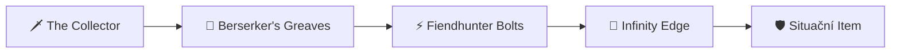
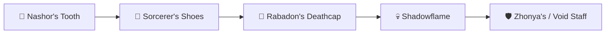

# 🛸 LEAGUE OF LEGENDS // PROTOCOL: ANTIGRAVITY


> *High-Performance Ranked Execution, Ergonomic Health Blueprint & Complete Twitch Matchup Guide.*

---

## 📅 System Overview & Weekly Schedule

| Day | Session Volume | VOD Analysis | Focus & Directives |
| :--- | :---: | :---: | :--- |
| **Pondělí** | `3–5 games` | 10 min | 🏫 Školní den • Disciplína |
| **Úterý** | `3–5 games` | 10 min | 🏫 Školní den • Disciplína |
| **Středa** | `3–5 games` | 10 min | 🏫 Školní den • Disciplína |
| **Čtvrtek** | `3–5 games` | 10 min | 🏫 Školní den • Disciplína |
| **Pátek** | `4–8 games` | 20 min | 🚀 **Návrat na EUW! Delší session.** |
| **Sobota** | `8–14 games` | 30 min | 🔥 **MAXIMUM GRIND. Ranní start!** |
| **Neděle** | `8–14 games` | 30 min | 🔥 **MAXIMUM GRIND. Ranní start!** |

> [!NOTE]
> **Týdenní target:** `32–56 her/týden` | **VOD Time:** `~2 hodiny`  
> **Měsíční celkový objem:** `~130–220 her za měsíc`

---

## 🚨 Emergency Controls (LP Safeguard Protocol)

> [!CAUTION]
> ### 🔴 RULE: STOP (Immediate Execution Termination)
> Abort session **instantly** if any of these conditions are met:
> 1. **2 prohry v řadě** → Pauza minimálně 1 hodinu.
> 2. **Cítíš vztek / Tilt** → Vypni hru, jdi na vzduch.
> 3. **Čas > 23:00** → Nulové výjimky. NIKDY nezačínej další.
> 4. **Fyzický discomfort (zápěstí/oči)** → Okamžitý stop, protažení, odpočinek.

> [!TIP]
> ### 🟢 RULE: CONTINUE (Green Light Checklist)
> Continue gaming session **only** when all conditions pass:
> - [x] **Flow State:** Vyhráváš a máš čistou hlavu.
> - [x] **Duty Free:** Žádné nevyřešené školní povinnosti na zítřek.
> - [x] **Physiology:** Cítíš se fyzicky odpočatý a bez bolesti.
> - [x] **Time Check:** Hodiny ukazují čas před 22:00.

---

## 🖐️ Anti-RSI Health Protocol (Wrist & Hand Care)

> [!IMPORTANT]
> **RSI Hazard Level: HIGH** (ADC Main + Quaver Player)  
> *Prováděj tento 2-minutový set během každé pauzy mezi bloky!*

```
[STRETCH ROUTINE] ──► 1. Prayer ──► 2. Circles ──► 3. Spread ──► 4. Shake Out
```

1. **🙏 Prayer Stretch (`30s`):** Spoj dlaně před hrudníkem (jako modlitba). Tlač dlaně dolů, dokud necítíš tah v zápěstích. *Drž 15s → Uvolni → Opakuj.*
2. **🔄 Wrist Circles (`30s`):** Zavři pěsti a kresli zápěstími pomalé, plynulé kruhy. *10× doprava, 10× doleva.*
3. **🖐️ Finger Spread (`30s`):** Rozevři všech 10 prstů co nejšíř na maximum. *Drž 5s → Zavři v pěst → Opakuj 5×.*
4. **👋 Shake Out (`30s`):** Uvolni paže a setřes ruce, jako bys z nich shazoval kapky vody. *30 sekund volného uvolňovacího třepání.*

---

## 🏆 Champion Pool pro Vyšší Ranky (High-Elo Expansion)

Pro stabilní climbing ve vyšších rancích (Emerald → Diamond → Master) je ideální udržovat **pool 2–3 championů**, kteří pokrývají různé týmové kompozice a draftové situace:

| Champion | Typ / Role | Kdy zvolit (Draft Condition) | Náročnost |
| :--- | :--- | :--- | :---: |
| 🐀 **Twitch** | **OTP / Primary Main** | Blind pick, potřeba carry z stealthu, hypercarry teamfight. | ⭐⭐⭐⭐☆ |
| 🚀 **Kai'Sa** | **Flex Carry (AD/AP)** | Tým má heavy engage, potřebuješ self-peel (R shield/dash) nebo hybrid DMG. | ⭐⭐⭐☆☆ |
| 💣 **Jinx** | **Hypercarry Standard** | Front-to-back teamfighty, silná CC kompozice, klasický DPS carry. | ⭐⭐☆☆☆ |
| 🪶 **Xayah** | **Anti-Dive Pick** | Soupeř má heavy engage / assassiny (Rengar, Nocturne, Nautilus, Zed). | ⭐⭐⭐⭐☆ |
| 🏹 **Varus** | **Utility & Poke / On-Hit** | Tým postrádá CC/Initiation nebo potřeba dominance na lince. | ⭐⭐⭐☆☆ |

---

## 🐀 Twitch Setup & Build Architectures (Patch 26.20 – Worlds 2026)

> [!NOTE]
> **Aktuální patch:** 26.20 (Worlds 2026 patch, vydán 7. října 2026).  
> Runaan's Hurricane a Experimental Hexplate dostaly nerf. Meta se přesunula k vysokému burst critu.  
> Výběr správného buildu závisí na kompozici soupeře. **AD** je nejlepší v dlouhých fightech a proti tankům, **AP** je destruktivní proti squishy týmům pro okamžitý burst z Q stealthu.

### 1. ⚔️ AD Twitch – „Spaceglide Crit Burst" (Hlavní build – Highest WR)
*Nejlepší proti: Většině kompozic. Dominantní v teamfightech s R.*



* **Core Build (1–3 itemy):**
  * 🗡️ `The Collector` – První item. Lethality + execute pod 5 % HP = snowball z raného leadu.
  * 👟 `Berserker's Greaves` – Základní boty pro attack speed.
  * ⚡ `Fiendhunter Bolts` – **KLÍČOVÝ ITEM pro Twitche v patchi 26.20.** Poskytuje Attack Speed, Crit a **30 Ultimate Ability Haste** (výrazně zkrátí cooldown na Spray and Pray). Pasivní efekt *Opening Barrage* dává bonus AS a posílí první 3 útoky po použití ulti → perfektní synergie s R.
  * 💎 `Infinity Edge` – Třetí hotový item. Obrovský damage spike díky zesílenému crit dmg.

* **Situační 4. a 5. item (vyber podle draftu):**
  * 🛡️ `Lord Dominik's Regards` – Soupeř má 2+ tanky s high armorem (Malphite, Ornn, Sejuani).
  * 🩸 `Mortal Reminder` – Soupeř má heavy healing (Soraka, Aatrox, Red Kayn, Vladimir).
  * 🛡️ `Guardian Angel` – Potřebuješ druhou šanci v klíčovém teamfightu (Baron/Elder).
  * ⚔️ `Bloodthirster` – Potřebuješ lifesteal a shield pro přežití v dlouhých fightech.
  * 🔓 `Mercurial Scimitar` – Soupeř má point-and-click CC (Malzahar R, Skarner R, Mordekaiser R).

* **Runy (AD – Patch 26.20):**
  * 🟡 **Precision (Primary):**
    * **Keystone:** `Lethal Tempo` (standard pro sustained DPS a spaceglide)
    * `Triumph` (heal po killu = přežití v teamfightech)
    * `Legend: Alacrity` (bonus AS pro plynulejší kiting)
    * `Cut Down` (bonus dmg proti HP stacking tankům)
  * 🔴 **Domination (Secondary):**
    * `Sudden Impact` (lethality bonus po vylezení ze stealthu Q – proc při každém otevření!)
    * `Relentless Hunter` (bonus MS out-of-combat = rychlejší roamy a rotace)

* **Summoner Spells:** `Flash` + `Ghost` (standardní pro spaceglide) NEBO `Flash` + `Cleanse` (proti Leona/Nautilus/Ashe heavy CC bot)

---

### 2. 🧪 AP Twitch – „Rat Assassin Burst" (Situační / Off-Meta)
*Nejlepší proti: Full squishy týmům bez tanků, kde potřebuješ okamžitý burst z Q stealthu.*



* **Core Build:**
  * 🦷 `Nashor's Tooth` – První item. AS + on-hit magic dmg synergizuje s passive jedem.
  * 👟 `Sorcerer's Shoes` – Magic Pen boty pro maximální burst.
  * 🎩 `Rabadon's Deathcap` – Obrovský AP spike, masivně zvyšuje E (Contaminate) damage.
  * 💀 `Shadowflame` – Burst multiplier pro squishy cíle.

* **Situační itemy:**
  * 🟣 `Void Staff` – Soupeř stackuje Magic Resist.
  * ⏳ `Zhonya's Hourglass` – Přežití po otevření ze stealthu (použij po R combo).
  * 📚 `Mejai's Soulstealer` – Riskantní, ale extrémně silný při snowballu.

* **Runy (AP – Patch 26.20):**
  * 🟡 **Precision (Primary):**
    * **Keystone:** `Press the Attack` (burst z 3 auto-attacků po otevření z Q) NEBO `Lethal Tempo`
    * `Presence of Mind` (mana sustain pro spam E)
    * `Legend: Alacrity` (AS)
    * `Cut Down` (bonus dmg)
  * 🔵 **Sorcery (Secondary):**
    * `Absolute Focus` (bonus AP při high HP = silnější opener ze stealthu)
    * `Gathering Storm` (scaling AP pro late game)

* **Summoner Spells:** `Flash` + `Ignite` (all-in burst) NEBO `Flash` + `Ghost`

> [!WARNING]
> **Kdy NEHRÁT AP Twitche:**  
> Pokud soupeř má 2+ tanky (Malphite, Ornn, Sejuani, Cho'Gath), AP Twitch je prakticky k ničemu. V takovém draftu jdi VŽDY AD s Lord Dominik's Regards.

---

## ⚔️ Twitch Bot Lane Matchup Matrix

```
 🟢 SNADNÉ (Favored)      🟡 SKILL MATCHUP (Even)     🔴 TĚŽKÉ (Counter)
 ───────────────────      ───────────────────────     ───────────────────
 • Jhin                   • Vayne                     • Caitlyn
 • Ezreal                 • Kai'Sa                    • Draven
 • Kog'Maw                • Jinx                      • Samira
 • Aphelios               • Lucian                    • Tristana
```

<details>
<summary>🔍 <b>Klikni pro detailní analýzu jednotlivých matchupů</b></summary>

### 🟢 Snadné matchupy
* **Jhin:** Nemá únik. Po 6. úrovni ho v Q stealthu snadno ustřílíš (all-in). Pozor na jeho 4. náboj a pasti.
* **Ezreal:** Vyhýbej se jeho Q za miniony. Pokud spotřebuje své E (E-dash), okamžitě aktivuj Q a jdi do all-inu.
* **Kog'Maw / Aphelios:** Jsou velmi zranitelní vůči stealth roamům a gankům. V duelu z překvapení vyhráváš.

### 🟡 Skill matchupy
* **Kai'Sa:** Kdo dá první burst, ten vyhrává. Nenech ji izolovat Q na tebe.
* **Vayne:** Vyhýbej se stěnám (E stun). Tvůj R má výrazně větší dosah v teamfightu než její kit.
* **Lucian:** Má extrémně silný burst na úrovních 2 a 3. Hraj defenzivně, dokud nemáš první item.

### 🔴 Těžké matchupy (Hraj opatrně / vyžadují pomoc)
* **Caitlyn:** Extrémní poke a dosah. Nenech se zatlačit pod věž a ztrácet HP. Čekej na gank nebo lvl 6 all-in.
* **Draven:** Má vyšší raw damage na prvních úrovních. NIKDY s ním neobchoduj damage 1v1 na lvl 1–3.
* **Samira:** Její W (Blade Whirl) zničí tvoji ultimátku (R projektily). Počkej, až pouští W, než zmáčkneš R.
* **Tristana:** Má silný all-in na lvl 2/3. Pokud skočí, použij W pro zpomalení a ustup.

</details>

---

## 🤝 Support Synergies (S kým hrát & Koho se bát)

### 💚 Nejlepší Supporti pro Twitche (God Tier Synergies)

| Support | Proč funguje | Synergy Rating |
| :--- | :--- | :---: |
| 🐱 **Yuumi** | Poskytuje adaptivní staty, MS, heal a štít přímo při stealthu. | ⭐⭐⭐⭐⭐ |
| 💜 **Lulu** | Pix dává extra AS, shield a Polymorph chrání před assassiny. | ⭐⭐⭐⭐⭐ |
| 🪵 **Milio** | Extrémně zvyšuje dosah útoků (range) a poskytuje cleanse. | ⭐⭐⭐⭐☆ |
| 🛡️ **Thresh / Pyke** | Skvělá kreator prostoru a možnost roamovat po mapě. | ⭐⭐⭐⭐☆ |

### 🚨 Nejnebezpečnější Supporti u Soupeře (Hard Engage / CC Threat)

> [!CAUTION]
> Proti těmto supportům si kupuj **Cleanse** nebo **Quicksilver Sash (QSS)** a drž si odstup od keřů:
> * ⚓ **Nautilus** (Point-and-click R, hook)
> * 🦁 **Leona** (Chain CC, neprůstřelná)
> * 🤖 **Blitzcrank** (Hook ruší stealth positioning)

---

## 🧠 High-Elo Game Plan Checklist

- [ ] **Lvl 1–3:** Soustřeď se na farmu, neztrácej zbytečně HP za 1 minion.
- [ ] **First Back:** Kup components na The Collector (Serrated Dirk) / Nashor (AP) + Control Ward.
- [ ] **Lvl 6 Power Spike:** Hledej Q roam na midlane nebo all-in na botu s ultimátkou.
- [ ] **Mid Game:** Nebuď vidět na mapě! Tlak ze stealthu nutil soupeře hrát opatrně.
- [ ] **Teamfights:** Počkej, až soupeř vypotřebuje klíčové CC (Malphite R, Nautilus R), pak se otevři z Q stealthu z bezpečné vzdálenosti a press R!

---

> 💡 **Core Mindset Directive:**  
> *Challenger hráč není ten, kdo hraje nejvíce her.*  
> *Je to ten, kdo hraje **nejchytřeji** a k počítači sedá **vždy 100% připravený**.*